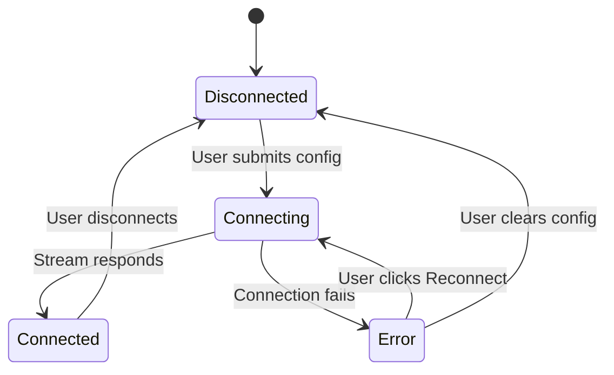

# Design Document: Comprehensive Dashboard

## Overview

This design transforms the existing AgriTech dashboard from a basic metrics/table/list view into a data-rich, production-quality dashboard with interactive Recharts-based time-series graphs, expanded mock datasets, new domain widgets (Weather, Crop Health, Robot Fleet), and a dedicated NVIDIA Isaac Sim integration panel with WebRTC viewport embedding.

The current dashboard has:
- `MetricsOverview` — 4 static metric cards (temperature, humidity, soil moisture, alerts)
- `SensorDataWidget` — tabular sensor readings
- `AlertsWidget` — list of 3 mock alerts
- `AnalyticsWidget` — placeholder with `MediaPlaceholder`
- `SimulationList` / `SimulationViewer` — basic simulation browsing

The enhanced dashboard adds:
- Sparkline graphs on metric cards (12h trend data)
- Interactive line charts on the Analytics page (24h sensor time-series via Recharts)
- 8+ diverse mock alerts sorted by severity
- Weather conditions widget (current + 5-day forecast)
- Crop health overview widget (6 zones)
- Robot fleet status widget (6 robots)
- Isaac Sim connection panel with config form, status indicator, and local storage persistence
- Isaac Sim live viewport embed (16:9 iframe/WebRTC area with fullscreen and quality controls)
- Isaac Sim simulation scenarios list with launch flow
- Responsive grid layout on the overview page

## Architecture

The architecture follows the existing pattern: a FastAPI backend serving mock data through REST endpoints, consumed by a React frontend using TanStack Query for data fetching and caching.

```mermaid
graph TD
    subgraph Frontend [React Frontend]
        DL[DashboardLayout] --> MO[MetricsOverview + Sparklines]
        DL --> AW[AnalyticsWidget + Recharts]
        DL --> ALW[AlertsWidget]
        DL --> WW[WeatherWidget]
        DL --> CHW[CropHealthWidget]
        DL --> RFW[RobotFleetWidget]
        DL --> ISP[IsaacSimPanel]
        ISP --> CF[ConnectionForm]
        ISP --> VP[ViewportEmbed]
        ISP --> SL[ScenarioList]
    end

    subgraph Backend [FastAPI Backend]
        FR[farms router] --> TS[/farms/sensors/timeseries]
        FR --> TR[/farms/trends]
        FR --> AL[/farms/alerts - expanded]
        WR[weather router] --> WE[/weather/current]
        WR --> WF[/weather/forecast]
        CR[crops router] --> CH[/crops/health]
        RR[robots router] --> RS[/robots/fleet]
        SR[simulations router] --> SC[/simulations/scenarios]
    end

    MO -->|GET /api/farms/trends| TR
    AW -->|GET /api/farms/sensors/timeseries| TS
    ALW -->|GET /api/farms/alerts| AL
    WW -->|GET /api/weather/current & /forecast| WR
    CHW -->|GET /api/crops/health| CR
    RFW -->|GET /api/robots/fleet| RR
    ISP -->|GET /api/simulations/scenarios| SC
```

### Key Design Decisions

1. **Recharts for charting** — Already implied by requirements; lightweight, composable, React-native. Added as a frontend dependency.
2. **New backend routers** — Weather, crops, and robots get their own routers (like existing `farms` and `simulations`) to maintain separation of concerns.
3. **Isaac Sim connection state in React state + localStorage** — No backend involvement for connection config; it's purely client-side since the WebRTC stream connects directly from the browser to the Isaac Sim server.
4. **Mock data generators as module-level constants** — Consistent with the existing pattern in `farms.py` and `simulations.py`. Time-series data is generated programmatically with realistic ranges.
5. **Overview page composition** — The dashboard index route renders a composite overview component that embeds MetricsOverview (with sparklines), a sensor trend mini-chart, recent alerts summary, and weather widget in a responsive grid.

## Components and Interfaces

### New Backend Endpoints

| Endpoint | Method | Router | Response Model | Description |
|---|---|---|---|---|
| `/api/farms/sensors/timeseries` | GET | farms | `TimeSeriesResponse` | 24h of sensor readings at 30-min intervals, filterable by `sensor_type` and `hours` query params |
| `/api/farms/trends` | GET | farms | `TrendsResponse` | 12 hourly aggregated metric values for sparklines |
| `/api/weather/current` | GET | weather | `CurrentWeatherResponse` | Current weather conditions |
| `/api/weather/forecast` | GET | weather | `ForecastResponse` | 5-day daily forecast |
| `/api/crops/health` | GET | crops | `CropHealthResponse` | Zone-level crop health data |
| `/api/robots/fleet` | GET | robots | `RobotFleetResponse` | Robot status list with summary counts |
| `/api/simulations/scenarios` | GET | simulations | `ScenariosResponse` | Predefined Isaac Sim scenarios |

### New Frontend Components

| Component | Location | Props / State | Description |
|---|---|---|---|
| `SensorTimeSeriesChart` | `features/dashboard/SensorTimeSeriesChart.tsx` | Fetches from `/api/farms/sensors/timeseries` | Recharts `LineChart` with 4 sensor lines, tooltip, legend |
| `SparklineCard` | `features/dashboard/SparklineCard.tsx` | `{label, value, unit, data, color}` | Metric card with embedded Recharts `AreaChart` sparkline |
| `WeatherWidget` | `features/dashboard/WeatherWidget.tsx` | Fetches from `/api/weather/current` and `/api/weather/forecast` | Current conditions + 5-day forecast cards |
| `CropHealthWidget` | `features/dashboard/CropHealthWidget.tsx` | Fetches from `/api/crops/health` | Zone list with health status badges |
| `RobotFleetWidget` | `features/dashboard/RobotFleetWidget.tsx` | Fetches from `/api/robots/fleet` | Robot list with status summary bar |
| `IsaacSimPanel` | `features/dashboard/IsaacSimPanel.tsx` | Local state + localStorage | Connection form, status indicator, viewport, scenarios |
| `IsaacSimViewport` | `features/dashboard/IsaacSimViewport.tsx` | `{connectionStatus, streamUrl}` | 16:9 iframe/video embed with fullscreen and quality controls |
| `IsaacSimScenarioList` | `features/dashboard/IsaacSimScenarioList.tsx` | Fetches from `/api/simulations/scenarios` | Scenario cards with launch button |
| `DashboardOverview` | `features/dashboard/DashboardOverview.tsx` | Composes child widgets | Grid layout composing sparkline metrics, mini chart, alerts summary, weather |

### Modified Components

| Component | Changes |
|---|---|
| `MetricsOverview` | Replaced with `DashboardOverview` as the index route; sparkline cards replace static cards |
| `AnalyticsWidget` | Replaced placeholder with `SensorTimeSeriesChart` |
| `AlertsWidget` | Sorts alerts by severity (critical → warning → info) |
| `DashboardLayout` | Add nav items for Weather, Crop Health, Isaac Sim, Robot Fleet |
| `App.tsx` | Add routes for new pages |

### Isaac Sim Connection Flow



Connection settings (host, port, streaming URL) are persisted to `localStorage` under key `isaac-sim-config`. On mount, the panel reads from localStorage and restores previous settings.

## Data Models

### Backend Models (Pydantic)

```python
# --- Time Series (farms router) ---
class TimeSeriesPoint(BaseModel):
    timestamp: datetime
    value: float

class SensorTimeSeries(BaseModel):
    sensor_type: SensorType  # reuse existing enum
    unit: str
    points: list[TimeSeriesPoint]

class TimeSeriesResponse(BaseModel):
    data: list[SensorTimeSeries]

# --- Trends (farms router) ---
class TrendPoint(BaseModel):
    hour: str          # e.g. "10:00"
    value: float

class MetricTrend(BaseModel):
    metric: str        # "temperature", "humidity", "soil_moisture", "active_alerts"
    unit: str
    current_value: float
    points: list[TrendPoint]

class TrendsResponse(BaseModel):
    data: list[MetricTrend]

# --- Weather (weather router) ---
class CurrentWeather(BaseModel):
    temperature: float
    humidity: float
    wind_speed: float
    condition: str     # "sunny", "cloudy", "rainy", "partly_cloudy", "thunderstorm"
    location: str

class DailyForecast(BaseModel):
    date: str          # ISO date
    high: float
    low: float
    condition: str
    humidity: float

class CurrentWeatherResponse(BaseModel):
    data: CurrentWeather

class ForecastResponse(BaseModel):
    data: list[DailyForecast]

# --- Crop Health (crops router) ---
class HealthStatus(str, Enum):
    healthy = "healthy"
    needs_attention = "needs_attention"
    critical = "critical"

class ZoneCropHealth(BaseModel):
    zone_id: str
    zone_name: str
    crop_type: str
    health_status: HealthStatus
    growth_stage: str
    last_inspection: datetime
    notes: str

class CropHealthResponse(BaseModel):
    data: list[ZoneCropHealth]

# --- Robot Fleet (robots router) ---
class RobotType(str, Enum):
    drone = "drone"
    ground_rover = "ground_rover"
    harvester = "harvester"

class RobotStatus(str, Enum):
    active = "active"
    idle = "idle"
    charging = "charging"
    maintenance = "maintenance"

class Robot(BaseModel):
    robot_id: str
    name: str
    type: RobotType
    status: RobotStatus
    assigned_zone: str
    battery_level: int  # 0-100

class RobotStatusSummary(BaseModel):
    active: int
    idle: int
    charging: int
    maintenance: int

class RobotFleetResponse(BaseModel):
    summary: RobotStatusSummary
    data: list[Robot]

# --- Isaac Sim Scenarios (simulations router) ---
class SimulationScenario(BaseModel):
    scenario_id: str
    name: str
    description: str
    robot_type: RobotType
    estimated_duration_minutes: int

class ScenariosResponse(BaseModel):
    data: list[SimulationScenario]
```

### Frontend TypeScript Interfaces

```typescript
// Time series
interface TimeSeriesPoint { timestamp: string; value: number }
interface SensorTimeSeries { sensor_type: string; unit: string; points: TimeSeriesPoint[] }
interface TimeSeriesResponse { data: SensorTimeSeries[] }

// Trends
interface TrendPoint { hour: string; value: number }
interface MetricTrend { metric: string; unit: string; current_value: number; points: TrendPoint[] }
interface TrendsResponse { data: MetricTrend[] }

// Weather
interface CurrentWeather { temperature: number; humidity: number; wind_speed: number; condition: string; location: string }
interface DailyForecast { date: string; high: number; low: number; condition: string; humidity: number }
interface CurrentWeatherResponse { data: CurrentWeather }
interface ForecastResponse { data: DailyForecast[] }

// Crop Health
interface ZoneCropHealth { zone_id: string; zone_name: string; crop_type: string; health_status: "healthy" | "needs_attention" | "critical"; growth_stage: string; last_inspection: string; notes: string }
interface CropHealthResponse { data: ZoneCropHealth[] }

// Robot Fleet
interface Robot { robot_id: string; name: string; type: "drone" | "ground_rover" | "harvester"; status: "active" | "idle" | "charging" | "maintenance"; assigned_zone: string; battery_level: number }
interface RobotStatusSummary { active: number; idle: number; charging: number; maintenance: number }
interface RobotFleetResponse { summary: RobotStatusSummary; data: Robot[] }

// Isaac Sim
interface IsaacSimConfig { host: string; port: number; streamUrl: string }
type ConnectionStatus = "disconnected" | "connecting" | "connected" | "error"
interface SimulationScenario { scenario_id: string; name: string; description: string; robot_type: string; estimated_duration_minutes: number }
interface ScenariosResponse { data: SimulationScenario[] }
```


## Correctness Properties

*A property is a characteristic or behavior that should hold true across all valid executions of a system — essentially, a formal statement about what the system should do. Properties serve as the bridge between human-readable specifications and machine-verifiable correctness guarantees.*

### Property 1: Time-series data interval consistency

*For any* valid time range parameter (hours) and sensor type, the time-series endpoint SHALL return data points where consecutive timestamps differ by exactly 30 minutes, and the total number of points equals `hours * 2`.

**Validates: Requirements 1.2**

### Property 2: Chart renders all sensor type lines

*For any* valid time-series response containing data for N sensor types, the chart component SHALL render exactly N line series, one for each sensor type present in the data.

**Validates: Requirements 1.1**

### Property 3: Sparkline card renders trend data for all metrics

*For any* valid trends response containing metric trend data, the dashboard SHALL render a sparkline card for each metric, and each card's sparkline data points SHALL match the corresponding trend data.

**Validates: Requirements 2.1**

### Property 4: Mock sensor data falls within realistic agricultural ranges

*For any* generated mock trend data point, temperature values SHALL be between 20 and 35 (°C), humidity values SHALL be between 50 and 90 (%), and soil moisture values SHALL be between 30 and 70 (%).

**Validates: Requirements 2.3**

### Property 5: Alerts are sorted by severity

*For any* list of alerts with mixed severities, after sorting, all critical alerts SHALL appear before all warning alerts, and all warning alerts SHALL appear before all info alerts. Formally: for indices i < j, `severityRank(alerts[i]) >= severityRank(alerts[j])`.

**Validates: Requirements 3.3**

### Property 6: Weather widget displays all required fields

*For any* valid current weather data object, the rendered weather widget output SHALL contain the temperature, humidity, wind speed, and condition values from the data.

**Validates: Requirements 4.1**

### Property 7: Mock weather data is consistent with tropical region

*For any* generated mock weather data point (current or forecast), temperature values SHALL be between 24 and 36 (°C) and humidity values SHALL be between 55 and 95 (%), consistent with Singapore's tropical climate.

**Validates: Requirements 4.4**

### Property 8: Crop health zone data completeness

*For any* valid zone crop health data object, the rendered crop health widget output SHALL contain the zone's health status indicator, crop type, growth stage, and last inspection date.

**Validates: Requirements 5.1, 5.2**

### Property 9: Isaac Sim connection status indicator correctness

*For any* connection status value in {disconnected, connecting, connected, error}, the Isaac Sim panel SHALL render a status indicator with the corresponding color code (gray for disconnected, yellow for connecting, green for connected, red for error).

**Validates: Requirements 6.2**

### Property 10: Isaac Sim connection config validation

*For any* string input for host and any numeric input for port, the validation function SHALL accept the input if and only if the host is non-empty (after trimming whitespace) AND the port is an integer between 1 and 65535 inclusive.

**Validates: Requirements 6.3**

### Property 11: Isaac Sim config localStorage round-trip

*For any* valid Isaac Sim connection config (host, port, streamUrl), serializing to localStorage and then deserializing SHALL produce an equivalent config object.

**Validates: Requirements 6.5**

### Property 12: Robot fleet summary counts match data

*For any* list of robots, the summary counts (active, idle, charging, maintenance) SHALL each equal the number of robots in the list with that corresponding status.

**Validates: Requirements 8.2**

### Property 13: Robot fleet displays all required fields

*For any* valid robot data object, the rendered robot fleet widget output SHALL contain the robot's name, type, status, and assigned zone.

**Validates: Requirements 8.1**

### Property 14: Maintenance robots are highlighted

*For any* robot in the fleet list, the robot row SHALL have a warning indicator if and only if the robot's status is "maintenance".

**Validates: Requirements 8.5**

### Property 15: Scenario list displays all required fields

*For any* valid simulation scenario data object, the rendered scenario list output SHALL contain the scenario's name, description, robot type, and estimated duration.

**Validates: Requirements 10.1**

## Error Handling

### Backend Error Handling

All new endpoints follow the existing error handling patterns established in `main.py`:

- **Validation errors** (422): Pydantic model validation failures return structured error with `code: "VALIDATION_ERROR"`
- **Not found** (404): Invalid resource IDs return `code: "HTTP_ERROR"` with descriptive detail
- **Internal errors** (500): Unhandled exceptions are caught by the global handler, logged, and return `code: "INTERNAL_ERROR"`

New endpoints use query parameter validation via FastAPI's `Query()` with constraints (e.g., `hours: int = Query(default=24, ge=1, le=168)` for time-series).

### Frontend Error Handling

All new widgets follow the existing `ErrorRetry` pattern:

1. Each widget uses TanStack Query's `isError` / `error` states
2. On error, render `<ErrorRetry message={...} onRetry={() => refetch()} />`
3. Loading states use skeleton placeholders consistent with existing widgets

Isaac Sim-specific error handling:
- Connection failures display the error message in the status indicator area with a "Reconnect" button
- Invalid form inputs show inline validation messages (red text below the field)
- localStorage read failures fall back to default empty config silently

### Data Validation

- Frontend TypeScript interfaces enforce response shape at compile time
- Backend Pydantic models enforce response shape at runtime
- Mock data generators use constrained ranges to ensure realistic values
- The time-series endpoint validates `hours` and `sensor_type` query params

## Testing Strategy

### Unit Tests (Vitest + React Testing Library)

Unit tests cover specific examples, edge cases, and integration points:

- **Chart rendering**: Verify `SensorTimeSeriesChart` renders with mock data, shows loading skeleton, shows error state
- **SparklineCard**: Verify renders label, value, unit, and sparkline SVG element
- **WeatherWidget**: Verify renders current conditions and 5-day forecast cards
- **CropHealthWidget**: Verify renders zone list with correct status badges
- **RobotFleetWidget**: Verify renders summary bar and robot list, highlights maintenance rows
- **IsaacSimPanel**: Verify form renders all fields, validates inputs, persists to localStorage, shows correct viewport state per connection status
- **AlertsWidget**: Verify alerts render sorted by severity with expanded mock data
- **DashboardOverview**: Verify all sub-widgets render on the overview page
- **Backend endpoints**: Verify each new endpoint returns correct response structure and status codes

### Property-Based Tests (fast-check + Vitest)

The project already uses `fast-check` (see `package.json` devDependencies). Each correctness property is implemented as a single property-based test with minimum 100 iterations.

Each test is tagged with a comment referencing the design property:
```
// Feature: comprehensive-dashboard, Property {N}: {property_text}
```

Property test plan:

| Property | Test Description | Generator Strategy |
|---|---|---|
| 1 | Time-series interval consistency | Generate random `hours` (1-168), verify point count = hours*2 and intervals = 30min |
| 2 | Chart renders all sensor lines | Generate random subset of sensor types with random data, verify line count matches |
| 3 | Sparkline cards for all metrics | Generate random trends data for 1-4 metrics, verify card count matches |
| 4 | Mock sensor data ranges | Generate random trend points, verify temperature ∈ [20,35], humidity ∈ [50,90], soil ∈ [30,70] |
| 5 | Alert severity sorting | Generate random lists of alerts with random severities, apply sort, verify ordering invariant |
| 6 | Weather widget field completeness | Generate random weather data, render, verify all fields present in output |
| 7 | Tropical weather data ranges | Generate random weather points, verify temp ∈ [24,36], humidity ∈ [55,95] |
| 8 | Crop health zone completeness | Generate random zone data, render, verify health status + crop type + growth stage + inspection date present |
| 9 | Connection status indicator | Generate random status from enum, verify correct color class applied |
| 10 | Connection config validation | Generate random strings/numbers for host/port, verify validation accepts iff host non-empty and port ∈ [1,65535] |
| 11 | Config localStorage round-trip | Generate random config objects, serialize to localStorage, deserialize, verify equality |
| 12 | Robot fleet summary counts | Generate random robot lists with random statuses, compute summary, verify counts match |
| 13 | Robot fleet field completeness | Generate random robot data, render, verify name + type + status + zone present |
| 14 | Maintenance robot highlighting | Generate random robot lists, verify warning indicator iff status = "maintenance" |
| 15 | Scenario list field completeness | Generate random scenario data, render, verify name + description + robot type + duration present |

### Backend Property Tests (Hypothesis + pytest)

For Python backend, use `hypothesis` library for property-based testing of:
- Mock data generator value ranges (Properties 4, 7)
- Time-series point generation interval consistency (Property 1)
- Alert sorting logic (Property 5)
- Robot fleet summary computation (Property 12)

Each backend property test runs minimum 100 examples and is tagged:
```python
# Feature: comprehensive-dashboard, Property {N}: {property_text}
```
